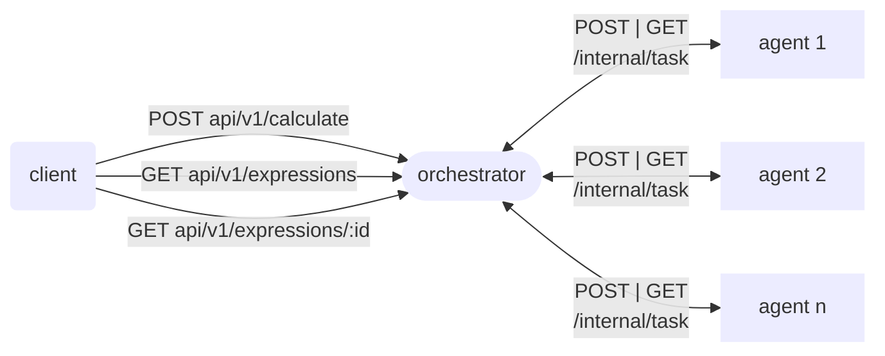

# Распределенный веб-сервис для вычисления арифметических выражений c веб-интерфейсом

[](https://deepwiki.com/jaam8/web_calculator)
[](https://goreportcard.com/report/github.com/jaam8/web_calculator)
[](https://wakatime.com/badge/user/018badf6-44ca-4a0f-82e9-9b27db08764a/project/2fbf499e-2c9f-47af-aa8f-c602090518fe)
## Описание

---
Этот проект реализует веб-сервис, который распределенно вычисляет арифметические выражения, переданные пользователем через HTTP-запрос.
Сервис поддерживает:

- Вычисление арифметических выражений с операторами: `+`, `-`, `*`, `/`, `(`, `)`

- Обработку ошибок, если выражение некорректно или произошла внутренняя ошибка сервиса.


## Схема работы

---


## Веб-интерфейс

---
<details>
    <summary>Нажми, чтобы увидеть темную тему</summary>

   
   
</details>
<details>
  <summary>Нажми, чтобы увидеть светлую тему</summary>

  
  
</details>

## Требования к окружению

---
- [Golang 1.22+](https://go.dev/)
- ОС **Linux**, **macOS** или [WSL2](https://learn.microsoft.com/ru-ru/windows/wsl/install) на Windows
- Терминал с поддержкой `bash`

## Установка и запуск

---
### 1. Склонируйте репозиторий:
```bash
git clone https://github.com/jaam8/web_calculator.git
cd web_calculator
```
### 2. Установите зависимости:
```bash
go mod tidy
```

### 3. Cкопируйте и по желанию измените файл `.env`:
**в `.env.example` уже указаны значения по умолчанию**
```bash
cp .env.example .env
```
Значение переменных среды: 
```dotenv
REQUEST_URL=<url для запроса агента>
PORT=<порт для запуска сервиса>
TIME_ADDITION_MS=<время выполнения сложения в миллисекундах>
TIME_SUBTRACTION_MS=<время выполнения вычитания в миллисекундах>
TIME_MULTIPLICATIONS_MS=<время выполнения умножения в миллисекундах>
TIME_DIVISIONS_MS=<время выполнения деления в миллисекундах>
COMPUTING_POWER=<колличество агентов (горутин)>
WAIT_TIME_MS=<время между запросов агента в миллисекундах>
```

### 4. Запустите проект с помощью команды:
- Запуск оркестратора и агента:
    ```bash
    go run ./cmd/main.go
    ```
- Запуск фронтенда:
   ```bash
  go run ./frontend/main.go
  ```
- Запуск только оркестратора:
    ```bash
    go run ./cmd/orchestrator/main.go
    ```
- Запуск только агента:
    ```bash
    go run ./cmd/agent/main.go
    ```

### 5. Фронтенд будет доступен по адресу: [http://localhost:8081](http://localhost:8081)

## Примеры и эндпоинты

---

## `POST /api/v1/calculate`
### Пример запроса:
```bash
curl --location 'localhost:8080/api/v1/calculate' \
--header 'Content-Type: application/json' \
--data '{"expression": "2 + 2 * 2"}'
```

### Ответы сервиса:
1. Выражение принятно для вычисления
   - HTTP код: `201`
   - Тело ответа:
      ```json
      {"id": "<id выражения>"}
      ```

2. Некорректное выражение:
   - HTTP код: `422`
   - Тело ответа:
     ```json
     "invalid expression"
     ```

3. Что-то пошло не так:
   - HTTP код: `500`
   - Тело ответа:
     ```json
     "internal server error"
     ```
## `GET /api/v1/expressions`
### Пример запроса:

```bash
curl --location 'localhost:8080/api/v1/expressions'
```
### Ответы сервиса:
1. Успешно получен список выражений
    - HTTP код: `200`
    - Пример ответа:
    ```json
   {
       "expressions": [
           {
               "id": 1,
               "status": "done",
               "result": 6
           },
           {
               "id": 2,
               "status": "pending",
               "result": 0
           }
        ]
   }
    ```
      
2. Что-то пошло не так:
    - HTTP код: `500`
    - Тело ответа:
      ```json
      "internal server error"
      ```
      
## `GET /api/v1/expressions/:id`
### Пример запроса:
```bash
curl --location 'localhost:8080/api/v1/expressions/1'
```
### Ответы сервиса:
1. Успешно получен список выражений
    - HTTP код: `200`
    - Пример ответа:
    ```json
    {
      "expression":
      {
        "id": 1,
        "status": "done",
        "result": 6
      }
    } 
    ```
2. Выражение не найдено
    - HTTP код: `404`
    - Тело ответа:
      ```json
      "expression not found"
      ```
      
3. Что-то пошло не так
    - HTTP код: `500`
    - Тело ответа:
      ```json
      "internal server error"
      ```
      
## `GET /internal/task`
### Пример запроса:
```bash
curl --location 'localhost:8080/internal/task'
```
### Ответы сервиса:
1. Успешно получена задача
    - HTTP код: `200`
    - Пример ответа:
    ```json
    {
        "task":
            {
                "id": 1,
                "arg1": 2,
                "arg2": 2,
                "operation": "*",
                "operation_time": 1000
            }
    }
    ```
2. Нет задачи для выполнения
    - HTTP код: `404`
    - Тело ответа:
      ```json
      "task not found"
      ```

3. Что-то пошло не так
    - HTTP код: `500`
    - Тело ответа:
      ```json
      "internal server error"
      ```
      
## `POST /internal/task`
### Пример запроса:
```
curl --location 'localhost:8080/internal/task' \
--header 'Content-Type: application/json' \
--data '{
  "id": 1,
  "result": 4
}'
```

### Ответы сервиса:
1. Результат задачи успешно записан
    - HTTP код: `200`
    - Тело ответа:
       ```json
       "task completed"
       ```

2. Задача не найдена
    - HTTP код: `404`
    - Тело ответа:
      ```json
      "task not found"
      ```

3. Некорректные данные:
    - HTTP код: `422`
    - Тело ответа:
      ```json
      "invalid data"
      ```

4. Что-то пошло не так:
    - HTTP код: `500`
    - Тело ответа:
      ```json
      "internal server error"
      ```


## Тестирование

---
Для запуска тестов выполните:
```bash
go test ./...
```
