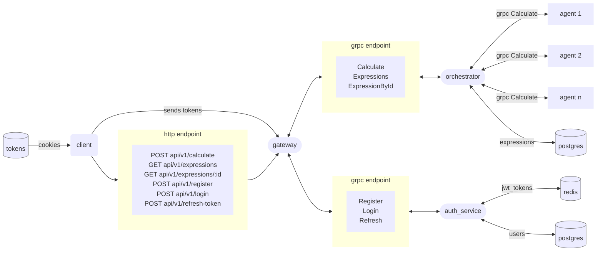
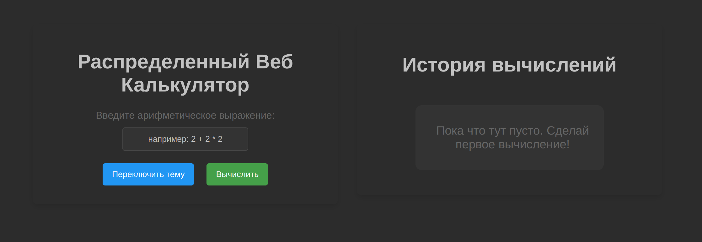
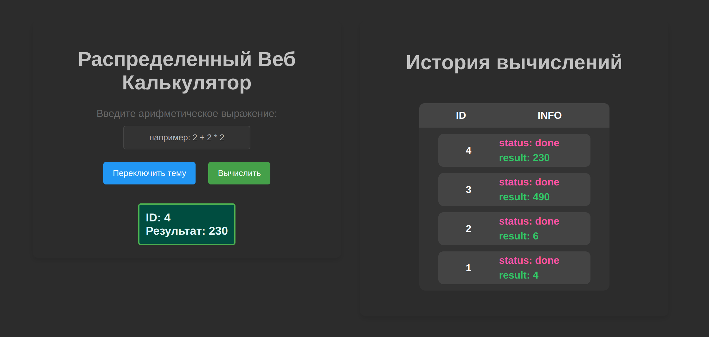
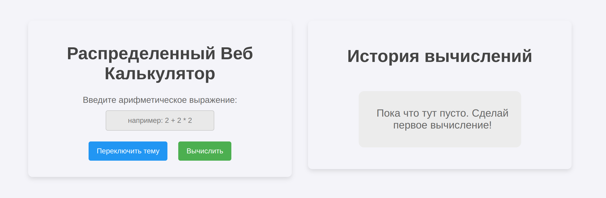
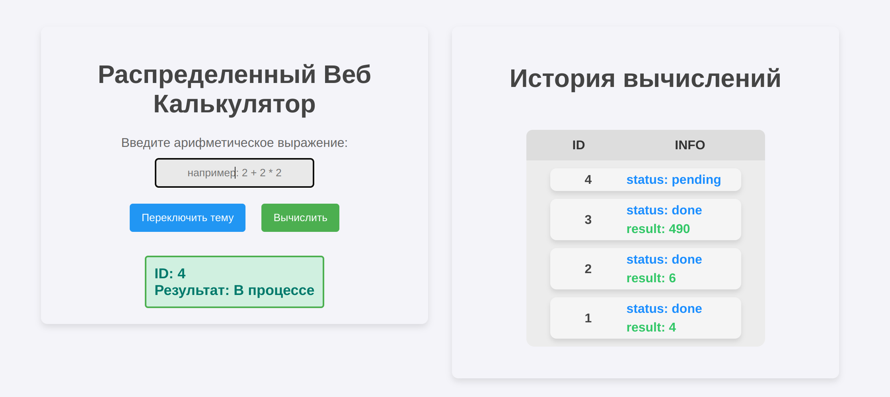

# Распределенный веб-сервис для вычисления арифметических выражений c веб-интерфейсом

[](https://deepwiki.com/jaam8/web_calculator)
[](https://goreportcard.com/report/github.com/jaam8/web_calculator)
[](https://wakatime.com/badge/user/018badf6-44ca-4a0f-82e9-9b27db08764a/project/2fbf499e-2c9f-47af-aa8f-c602090518fe)

## Описание

---
Этот проект реализует веб-сервис, который распределенно вычисляет арифметические выражения, переданные пользователем через HTTP-запрос.
Сервис поддерживает:

- Регистрацию и аутентификацию пользователей с использованием JWT-токенов.

- Вычисление арифметических выражений с операторами: `+`, `-`, `*`, `/`, `(`, `)`

- Обработку ошибок, если выражение некорректно или произошла внутренняя ошибка сервиса.

## Примеры и эндпоинты 
Запустите проект и  перейдите на [localhost:8080/swagger/index.html](http://localhost:8080/swagger/index.html)

## Схема работы

---


## Веб-интерфейс

---
<details>
    <summary>Нажми, чтобы увидеть темную тему</summary>

   
   
</details>
<details>
  <summary>Нажми, чтобы увидеть светлую тему</summary>

  
  
</details>

## Требования к окружению

---
- [Golang 1.22+](https://go.dev/)
- ОС **Linux**, **macOS** или [WSL2](https://learn.microsoft.com/ru-ru/windows/wsl/install) на Windows
- Терминал с поддержкой `bash`

## Установка и запуск

---
### 1. Склонируйте репозиторий:
```bash
git clone https://github.com/jaam8/web_calculator.git
cd web_calculator
```

### 2. Cкопируйте и по желанию измените файл `.env`:
**в `.env.example` уже указаны значения по умолчанию**
```bash
cp .env.example .env
```

### 3. Запуск проекта:
- Запуск с помощью `docker-compose`:
   ```bash
   docker-compose up -d
   ```
- Обычный запуск:
Установите зависимости для каждого сервиса:
    ```bash
    go mod tidy
    ```
    Запустите проект командой:
   ```bash
  make run
  ```

### 5. Фронтенд будет доступен по адресу: [http://localhost:8081](http://localhost:8081)

## Переменные окружения
| Переменная                             | Описание                                                             | Значение по умолчанию   |
|----------------------------------------|----------------------------------------------------------------------|-------------------------|
| `ORCHESTRATOR_HOST`                    | Хост сервиса оркестратора                                            | `localhost`             |
| `ORCHESTRATOR_PORT`                    | Порт сервиса оркестратора                                            | `50052`                 |
| `ORCHESTRATOR_TIMEOUT_MS`              | Таймаут запроса к оркестратору (в миллисекундах)                     | `3000`                  |
| `ORCHESTRATOR_MAX_RETRIES`             | Максимальное количество повторов запроса                             | `3`                     |
| `ORCHESTRATOR_BASE_RETRY_DELAY`        | Базовая задержка перед повторной попыткой (в миллисекундах)          | `2000`                  |
| `ORCHESTRATOR_TIME_ADDITION_MS`        | Время вычисления операции сложения (в миллисекундах)                 | `100`                   |
| `ORCHESTRATOR_TIME_SUBTRACTION_MS`     | Время вычисления операции вычитания (в миллисекундах)                | `100`                   |
| `ORCHESTRATOR_TIME_MULTIPLICATIONS_MS` | Время вычисления операции умножения (в миллисекундах)                | `100`                   |
| `ORCHESTRATOR_TIME_DIVISIONS_MS`       | Время вычисления операции деления (в миллисекундах)                  | `100`                   |
| `ORCHESTRATOR_UPSTREAM_NAME`           | Имя upstream сервиса оркестратора                                    | `orchestrator`          |
| `ORCHESTRATOR_UPSTREAM_PORT`           | Порт upstream сервиса оркестратора                                   | `50052`                 |
| `POSTGRES_HOST`                        | Хост базы данных PostgreSQL                                          | `postgres`              |
| `POSTGRES_PORT`                        | Порт PostgreSQL                                                      | `5432`                  |
| `POSTGRES_USER`                        | Пользователь для подключения к PostgreSQL                            | `postgres`              |
| `POSTGRES_PASSWORD`                    | Пароль для подключения к PostgreSQL                                  | `1234`                  |
| `POSTGRES_DB`                          | Имя базы данных для приложения                                       | `web_calculator`        |
| `REDIS_HOST`                           | Хост сервиса Redis                                                   | `redis`                 |
| `REDIS_PORT`                           | Порт Redis                                                           | `6379`                  |
| `AUTH_SERVICE_HOST`                    | Хост сервиса аутентификации                                          | `localhost`             |
| `AUTH_SERVICE_PORT`                    | Порт сервиса аутентификации                                          | `50051`                 |
| `AUTH_SERVICE_REDIS_DB`                | Номер базы данных Redis для аутентификации                           | `0`                     |
| `AUTH_SERVICE_TIMEOUT_MS`              | Таймаут запроса к сервису аутентификации (в миллисекундах)           | `3000`                  |
| `AUTH_SERVICE_MAX_RETRIES`             | Максимальное количество повторов запроса к сервису аутентификации    | `3`                     |
| `AUTH_SERVICE_BASE_RETRY_DELAY`        | Базовая задержка перед повторной попыткой (в миллисекундах)          | `2000`                  |
| `AUTH_SERVICE_UPSTREAM_NAME`           | Имя upstream сервиса аутентификации                                  | `auth_service`          |
| `AUTH_SERVICE_UPSTREAM_PORT`           | Порт upstream сервиса аутентификации                                 | `50051`                 |
| `AGENT_HOST`                           | Хост агента вычислений                                               | `localhost`             |
| `AGENT_PORT`                           | Порт агента вычислений                                               | `50053`                 |
| `AGENT_COMPUTING_POWER`                | Количество агентов (горутин) для вычислений                          | `2`                     |
| `AGENT_WAIT_TIME_MS`                   | Время ожидания между запросами агента (в миллисекундах)              | `1000`                  |
| `GRPC_POOL_MAX_CONNECTIONS`            | Максимальное количество gRPC-соединений                              | `100`                   |
| `GRPC_POOL_MIN_CONNECTIONS`            | Минимальное количество gRPC-соединений                               | `1`                     |
| `GRPC_POOL_MAX_RETRIES`                | Максимальное количество повторов gRPC-запроса                        | `3`                     |
| `GRPC_POOL_BASE_RETRY_DELAY_MS`        | Базовая задержка перед повторной попыткой gRPC-запроса (в миллисек.) | `300`                   |
| `GATEWAY_HOST`                         | Хост для gateway сервиса                                             | `localhost`             |
| `GATEWAY_PORT`                         | Порт для gateway сервиса                                             | `8080`                  |
| `MIGRATION_PATH`                       | Путь до файлов миграций БД                                           | `file:///db/migrations` |
| `LOG_LEVEL`                            | Уровень логирования                                                  | `debug`                 |
| `JWT_SECRET`                           | Секретный ключ для JWT                                               | `secret`                |
| `REFRESH_EXPIRATION`                   | Время жизни refresh-токена (в часах)                                 | `24`                    |
| `ACCESS_EXPIRATION`                    | Время жизни access-токена (в минутах)                                | `15`                    |

## Тестирование

---
Для запуска тестов выполните:
```bash
make test
```

Для запуска интеграционных тестов выполните:
```bash
cd integration_tests
go test ./...
```
